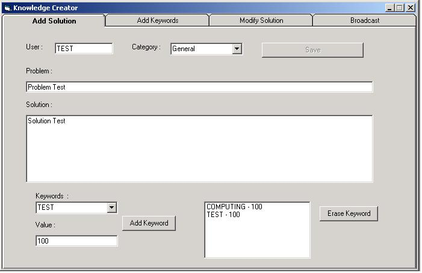

<div align="center">

## Knowledge Base


</div>

### Description

A must for Help Desk and Customer Support. A fully functionnal knowledgebase where you can insert a problem and a solution will appear based on the words you have entered!
 
### More Info
 


<span>             |<span>
---                |---
**Submitted On**   |2003-02-11 15:50:06
**By**             |[Denis Dubois](https://github.com/Planet-Source-Code/PSCIndex/blob/master/ByAuthor/denis-dubois.md)
**Level**          |Intermediate
**User Rating**    |4.3 (17 globes from 4 users)
**Compatibility**  |VB 6\.0, VB Script, VBA MS Access
**Category**       |[Databases/ Data Access/ DAO/ ADO](https://github.com/Planet-Source-Code/PSCIndex/blob/master/ByCategory/databases-data-access-dao-ado__1-6.md)
**World**          |[Visual Basic](https://github.com/Planet-Source-Code/PSCIndex/blob/master/ByWorld/visual-basic.md)
**Archive File**   |[Knowledge\_1542992112003\.zip](https://github.com/Planet-Source-Code/denis-dubois-knowledge-base__1-43146/archive/master.zip)

### API Declarations

```
Before you start these programs simply create an ODBC connection called KNOWLEGDEBASE to the database included.
This package includes 3 items :
1) Knowledge Creator
 This program will help you create your solutions for your users to use. Simply insert all the information about the problem and the solution then pick Keywords and add them to the solution with a value. the trick is the more words you put the more chances there is that your solution will come up first on the list if the user inputs them all. they are sorted by value so you can put important solutions on top.
 For example you can create a problem with the following Keywords/Values :
Problem #1
Keyboard - 100
Screen - 100
Black - 100
Problem #2
Screen - 100
Blue - 100
Microsoft - 100
If the user does a search for "Blue screen when entering Microsoft Windows XP", both solutions will appear but the problem #2 will be first since it's total score is higher. This will help users get the right solution very fast.
You can also modify existing solutions by picking them from the list or simply inputing the ID of the problem.
NOTE : Messenging is not implemented in the creator for now. You will have to change it manually in the database. Samething goes for changing Keywords/Values.
2) Knowledge Base
This is the search tool. Simply put any text to search for and choose a category. If the General Category is specified the program will look in all categories. If no search words are inserted the program will display all the solutions for that category. Simply click on a solution from the list to view it's content. The solution number will then appear for easy referrence.
 When you enter the program you might get a message if the administrator has inserted important Broadcast messages.
3) The Database
 The database also includes a knowledge creator for those who do not like the VB one and prefer playing with access. You can also add messages in the Broadcast table. Only active Broadcast will show so that you can keep old casts for refference.
This is my first submission and I would greatly appreciate your Comments/Suggestions.
```


